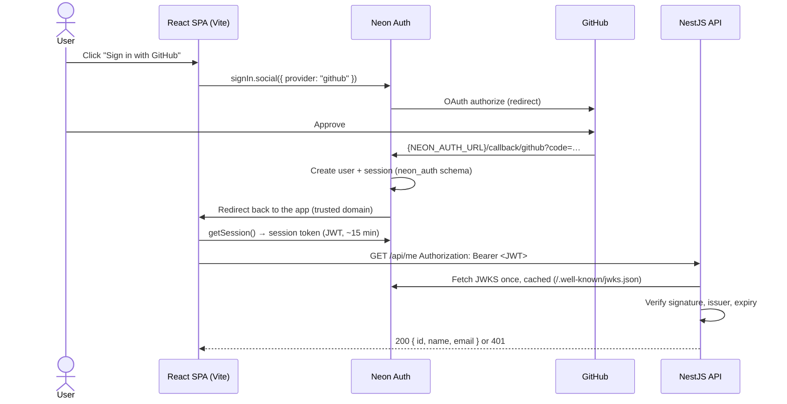

# Phase 1 — Authentication

Sign in with GitHub through **Neon Auth** (Neon's managed Better Auth), keep the dashboard behind login, and make the NestJS API reject any request without a valid Neon Auth token.

Sources: [`prd.md`](../prd.md) · [`tech-stack.md`](../tech-stack.md) · [`sessions.md`](../sessions.md) (Session 2)

---

## 1. Scope

| In scope | Out of scope (later phases) |
|---|---|
| "Sign in with GitHub" via Neon Auth | GitHub App registration and repo install (connect repo) |
| Session state, sign out | Webhooks, rules, actions, Slack |
| Protected routes in the React app | Dashboard content (event log, rules UI) |
| Backend JWT guard on every `/api/*` route | Multi-repo selection |
| `GET /api/me` returning the signed-in user | Hosting / production URLs |

### PRD requirements covered

| PRD item | How this phase covers it |
|---|---|
| Core 2 — GitHub sign-in | Neon Auth GitHub provider |
| Core 6 — dashboard behind login | Protected routes + API guard |
| Quality 1 — not foolable by forged requests | JWT signature, issuer and expiry checked against Neon Auth's JWKS |
| Quality 4 — never expose secrets | GitHub client secret lives only in Neon; no secrets in `VITE_*`; tokens never logged |
| Constraint — everything free, no card | Neon free tier + GitHub OAuth App are free |

---

## 2. How the flow works



**Key rules**
- The browser never sees the GitHub client secret; it is stored in Neon only.
- The backend trusts nothing but a JWT that verifies against Neon Auth's public keys.
- Users live in the `neon_auth` schema, which Neon manages. Our Prisma migrations never touch it.

---

## 3. What you need to do (manual steps)

Do these in order. **Never paste secrets into chat or commit them.** Values go only into the local `.env` files listed at the end.

### Step 0 — Prerequisites
- [ ] Node 24 installed (`node -v` shows `v24.x`). See Session 1, issue #1.
- [ ] Neon CLI logged in: `npm i -g neon@latest && neon login`.

### Step 1 — Enable Neon Auth
1. Open [console.neon.tech](https://console.neon.tech) → project **github-automation-bot** → branch **production**.
2. Open the **Auth** (Managed Better Auth) page → click **Enable**.
3. Copy the **Auth URL**. It looks like `https://ep-xxxx.neonauth.<region>.aws.neon.tech/neondb/auth`.
   - This URL is **not a secret**. You'll use it in both apps.

### Step 2 — Create a GitHub OAuth App (sign-in only)
GitHub has no shared dev credentials in Neon Auth, so you need your own OAuth App.

1. In Neon: **Settings → Auth → Add OAuth provider → GitHub**. Keep this dialog open and **copy the exact callback URL** it shows (format: `{AUTH_URL}/callback/github`).
2. In GitHub: **Settings → Developer settings → OAuth Apps → New OAuth App**.

   | Field | Value |
   |---|---|
   | Application name | `GitHub Automation Bot (dev)` |
   | Homepage URL | `http://localhost:5173` |
   | Authorization callback URL | the URL copied from the Neon dialog |
   | Enable Device Flow | leave unchecked |

3. Click **Register application**.
4. Copy the **Client ID**.
5. Click **Generate a new client secret** → copy it immediately (GitHub shows it once).

> This OAuth App is only for signing in. The GitHub App for repo access and webhooks comes in the next phase.

### Step 3 — Connect GitHub to Neon Auth
1. Back in the Neon dialog (**Add OAuth provider → GitHub**), paste the **Client ID** and **Client secret** → save.
2. The secret now lives in Neon. You don't need it anywhere else; you can delete your local copy.

### Step 4 — Allow the local app as a redirect target
1. Neon: **Settings → Auth → Trusted domains** → add `http://localhost:5173`.
2. Later (hosting phase) you'll add the production URL here too.

### Step 5 — Fill local env files
Create these files yourself (both are gitignored):

`frontend/.env.local`
```
VITE_NEON_AUTH_URL=<Auth URL from Step 1>
```

`backend/.env` (add to what's already there)
```
NEON_AUTH_URL=<same Auth URL from Step 1>
```

### Step 6 — Tell Claude "phase 1 setup done"
Claude then builds everything in section 4 and runs the checks in section 7 with you.

---

## 4. What Claude builds

### Packages

| Package | Workspace | Why |
|---|---|---|
| `@neondatabase/auth` (0.5 beta) | frontend | Official Neon Auth client: sign in, session, token. Chosen over `@neondatabase/neon-js`, which only re-exports it plus an unused data client |
| `react-router` | frontend | Login and protected routes |
| `zod` | frontend | Validate `VITE_*` env and `/api` responses (per tech-stack) |
| `jose` | backend | Verify JWTs against a remote JWKS; safer than hand-rolled crypto |

No other packages.

### Backend (`backend/src/`)

| # | File | What it does |
|---|---|---|
| B1 | `config/env.ts` | Add `NEON_AUTH_URL` (required URL) to the zod schema |
| B2 | `auth/auth.service.ts` | Cached `createRemoteJWKSet({NEON_AUTH_URL}/.well-known/jwks.json)`; `verify(token)` checks signature (EdDSA only), `iss` = Auth URL origin, `exp`; returns `{ id: sub, email, name }` |
| B3 | `auth/public.decorator.ts` | `@Public()` marks routes that skip auth (health, later webhooks) |
| B4 | `auth/current-user.decorator.ts` | `@CurrentUser()` injects the verified user into handlers |
| B5 | `auth/auth.guard.ts` | Global guard (`APP_GUARD`): reads `Authorization: Bearer`, calls `verify`, 401 on missing/invalid; logs the reason, never the token |
| B6 | `auth/me.controller.ts` | `GET /api/me` → current user |
| B7 | `auth/auth.module.ts` | Wires the above; imported by `AppModule` |
| B8 | `.env.example` | Adds `NEON_AUTH_URL` placeholder |

### Frontend (`frontend/src/`)

| # | File | What it does |
|---|---|---|
| F1 | `lib/env.ts` | zod-validate `import.meta.env` once (`VITE_NEON_AUTH_URL`) |
| F2 | `lib/auth-client.ts` | `createAuthClient(env.VITE_NEON_AUTH_URL, { adapter: BetterAuthReactAdapter() })` → `useSession()`, `signIn.social()`, `signOut()` |
| F3 | `lib/api.ts` | `apiFetch()` → JWT from `getSession().data.session.token` (SDK-cached, refreshed by `exp`), adds `Authorization: Bearer`, parses response with zod |
| F4 | `components/protected-route.tsx` | Loading state → redirect to `/login` when no session |
| F5 | `pages/login-page.tsx` | "Sign in with GitHub" button (shadcn `Button`) |
| F6 | `pages/dashboard-page.tsx` | Placeholder: calls `/api/me`, shows the user, sign-out button |
| F7 | `router.tsx`, `App.tsx` | Routes: `/login` (public), `/` (protected → dashboard) |
| F8 | `styles/components/auth.css` | Semantic classes (`.login-card`, `.user-badge`…) via `@apply`; imported in `globals.css` |
| F9 | `.env.example` | `VITE_NEON_AUTH_URL` placeholder |

### Order of work (one commit each)
1. B1–B8 backend guard + `/api/me` → check: `curl /api/me` returns 401.
2. F1–F3 env, auth client, api client.
3. F4–F9 routes, pages, styles.
4. End-to-end run, session logs, docs update.

---

## 5. Environment variables

| Variable | Where | Secret? | Source |
|---|---|---|---|
| `VITE_NEON_AUTH_URL` | `frontend/.env.local` | No (public URL) | Neon → Auth page |
| `NEON_AUTH_URL` | `backend/.env` | No (public URL) | Same value |
| GitHub OAuth Client ID / Secret | **Neon console only** | Secret: yes | GitHub OAuth App |

---

## 6. Security checklist

- [ ] Every `/api/*` route requires a valid JWT unless it has `@Public()`.
- [ ] JWT checks: signature (JWKS, EdDSA only — Neon Auth signs with Ed25519), issuer, expiry. Audience checked if Neon Auth sets `aud`.
- [ ] JWKS fetched once and cached by `jose` (handles key rotation).
- [ ] 401 responses carry no detail about why verification failed.
- [ ] Tokens, `Authorization` headers and cookies are redacted by the logger.
- [ ] No secret in any `VITE_*` variable or in the built frontend bundle.
- [ ] App code never writes tokens to `localStorage`; the SDK owns the session.
- [ ] Only `http://localhost:5173` (and later the production origin) in trusted domains.

---

## 7. Done when (verify together)

| # | Check | Expected |
|---|---|---|
| 1 | Open `http://localhost:5173` signed out | Redirected to `/login` |
| 2 | Click "Sign in with GitHub" and approve | Back on the dashboard, your GitHub name shown |
| 3 | Reload the page | Still signed in |
| 4 | Click "Sign out" | Back on `/login`; dashboard not reachable |
| 5 | `curl localhost:4000/api/me` (no token) | `401` |
| 6 | `curl` with a made-up or tampered token | `401` |
| 7 | Wait for token expiry (~15 min), use the app | Still works (SDK refreshes the token) |
| 8 | `curl localhost:4000/api/health` | `200` without a token |
| 9 | Neon → Tables → `neon_auth.user` | Your user row exists |
| 10 | `/check-secrets` | No findings |

---

## 8. To confirm while building

| Question | Why it matters |
|---|---|
| Does the Neon Auth JWT include an `aud` claim? | If yes, verify it too |
| ~~React hook for session~~ — confirmed: `authClient.useSession()` via `BetterAuthReactAdapter` | — |
| Where the GitHub user id is stored (`neon_auth.account` → `accountId` for `providerId = 'github'`) | Next phase matches GitHub App installs to the signed-in user |
| ~~Token refresh~~ — confirmed: session cached until JWT `exp`, then refetched | Check #7 above |

---

## References

- [Managed Better Auth overview](https://neon.com/docs/auth/overview)
- [Authentication flow](https://neon.com/docs/auth/authentication-flow)
- [Set up OAuth](https://neon.com/docs/auth/guides/setup-oauth)
- [JWT plugin](https://neon.com/docs/auth/guides/plugins/jwt)
- [React SPA + separate backend guide](https://neon.com/guides/react-neon-auth-hono)
