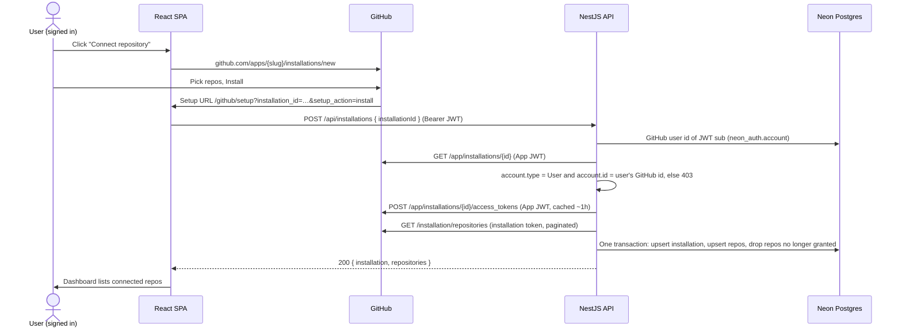

# Phase 2 — GitHub App and connected repositories

Register a **GitHub App**, let a signed-in user install it on their own account, and store the installation and its repositories so the dashboard can list them. This is the repo-access half of Session 2; sign-in (phase 1) is already done.

Sources: [`prd.md`](../prd.md) · [`tech-stack.md`](../tech-stack.md) · [`sessions.md`](../sessions.md) (Session 2) · [phase 1](phase-1.md)

---

## 1. Scope

| In scope                                                               | Out of scope (later phases)                                                           |
| ---------------------------------------------------------------------- | ------------------------------------------------------------------------------------- |
| Register the GitHub App (permissions, events, private key)             | Webhook endpoint, HMAC check, dedupe, queue (phase 3)                                 |
| App JWT (RS256) and cached installation tokens                         | `installation` / `installation_repositories` webhooks keeping repos in sync (phase 3) |
| "Connect repository" → GitHub install → setup callback                 | Rules, actions, Slack (phase 4)                                                       |
| Verify the installation belongs to the signed-in user                  | Org installations (personal accounts only for now)                                    |
| Store `installations` + `repositories`, list them, re-sync on demand   | Hosting / production URLs                                                             |
| `PrismaService` and the DB check in `/api/health` (Session 1 leftover) |                                                                                       |

### PRD requirements covered

| PRD item                                    | How this phase covers it                                                                                |
| ------------------------------------------- | ------------------------------------------------------------------------------------------------------- |
| Core 2 — connect a repository they own      | Install flow + ownership check against the signed-in GitHub id                                          |
| Stretch 3 — authenticate as a GitHub App    | App JWT signed with the private key, exchanged for installation tokens                                  |
| Stretch 4 — multi-repo                      | Every repo granted to the installation is stored and listed                                             |
| Quality 1 — not foolable by forged requests | `installation_id` from the setup URL is never trusted; the App API is the source of truth               |
| Quality 4 — never expose secrets            | Private key only in `backend/.env`; App JWT and installation tokens never logged or sent to the browser |

---

## 2. How the flow works



**Key rules**

- The setup URL's `installation_id` is attacker-controllable. The backend looks the installation up with the App JWT and only accepts it if its account is the signed-in user's GitHub account. This also defeats CSRF-style "install" links, so no extra `state` value is needed.
- The setup URL points at the **SPA**, not the API: only the SPA holds the Neon Auth JWT, so it forwards the id with a normal authenticated call.
- Private key, App JWT and installation tokens stay in the backend process. Nothing GitHub-issued reaches the browser.
- Same installation claimed twice (reinstall, "Configure" → `setup_action=update`) is an upsert, never a duplicate.

---

## 3. What you need to do (manual steps)

**Never paste secrets into chat or commit them.** Values go only into the local `.env` files listed at the end.

### Step 1 — Register the GitHub App

GitHub: **Settings → Developer settings → GitHub Apps → New GitHub App**.

| Field                                                  | Value                                                                    |
| ------------------------------------------------------ | ------------------------------------------------------------------------ |
| GitHub App name                                        | Must be globally unique, e.g. `<your-handle>-automation-bot`             |
| Homepage URL                                           | `http://localhost:5173`                                                  |
| Callback URL                                           | leave empty                                                              |
| Request user authorization (OAuth) during installation | **unchecked** (sign-in stays with Neon Auth)                             |
| Setup URL                                              | `http://localhost:5173/github/setup`                                     |
| Redirect on update                                     | **checked** (repo changes come back through the setup URL)               |
| Webhook → Active                                       | **unchecked** for now; phase 3 turns it on with a smee.io URL and secret |

**Repository permissions**

| Permission    | Access           | Why                                    |
| ------------- | ---------------- | -------------------------------------- |
| Metadata      | Read (mandatory) | List repositories                      |
| Issues        | Read & write     | Labels and comments on issues          |
| Pull requests | Read & write     | Labels and comments on PRs             |
| Contents      | Read             | Required to subscribe to `push` events |

**Subscribe to events:** Issues, Pull request, Push (greyed out until webhooks are active — tick them in phase 3 if so).

**Where can this GitHub App be installed?** → **Any account**, so a reviewer can install it on their own test repo later.

Click **Create GitHub App**.

### Step 2 — Collect the App's values

On the App's settings page:

1. **App ID** (a number) → `GITHUB_APP_ID`.
2. **Slug**: GitHub → **Settings → Developer settings → GitHub Apps** (not "OAuth Apps") → **Edit** on your App. The browser URL is `github.com/settings/apps/<slug>`; copy that last part (lowercase, hyphenated app name). Check: `github.com/apps/<slug>` opens the App's public page. → `GITHUB_APP_SLUG` / `VITE_GITHUB_APP_SLUG`.
3. **Private keys → Generate a private key** → a `.pem` file downloads. Keep it outside the repo (`*.pem` is gitignored anyway).
4. Encode it on one line for the env file:
   ```
   base64 -i ~/Downloads/<app>.private-key.pem | tr -d '\n'
   ```
   → `GITHUB_APP_PRIVATE_KEY`. Then store the `.pem` somewhere safe or delete it.

### Step 3 — Fill local env files

`backend/.env` (add)

```
GITHUB_APP_ID=<App ID>
GITHUB_APP_SLUG=<slug>
GITHUB_APP_PRIVATE_KEY=<base64 PEM, one line>
```

`frontend/.env.local` (add)

```
VITE_GITHUB_APP_SLUG=<slug>
```

### Step 4 — Tell Claude "phase 2 setup done"

Do **not** install the App yet — the install is check #1 in section 7.

---

## 4. What Claude builds

### Packages

None. App JWT uses `jose` (already installed) with a key from Node's `crypto.createPrivateKey`, which accepts GitHub's PKCS#1 PEM. GitHub calls use built-in `fetch`.

### Backend (`backend/src/`)

| #   | File                                                               | What it does                                                                                                                                                                                                            |
| --- | ------------------------------------------------------------------ | ----------------------------------------------------------------------------------------------------------------------------------------------------------------------------------------------------------------------- |
| B1  | `prisma/prisma.service.ts`, `prisma.module.ts`                     | Global `PrismaService` (pooled `DATABASE_URL`), connect on init, disconnect on shutdown                                                                                                                                 |
| B2  | `health/health.controller.ts`                                      | Adds `SELECT 1`; `{ status, db }`, `503` when the DB is down                                                                                                                                                            |
| B3  | `config/env.ts`                                                    | `GITHUB_APP_ID` (int), `GITHUB_APP_SLUG`, `GITHUB_APP_PRIVATE_KEY` (base64 → PEM, parsed at boot so a bad key fails fast)                                                                                               |
| B4  | `github/github-app.service.ts`                                     | Signs the App JWT (RS256, `iss` = App ID, `iat` −60 s, `exp` +9 min), reused until 1 min before expiry                                                                                                                  |
| B5  | `github/github-client.ts`                                          | `githubFetch(path, token, schema)`: API version header, `User-Agent`, zod-parsed response, typed error with status; never logs the token                                                                                |
| B6  | `github/installation-token.service.ts`                             | `POST /app/installations/{id}/access_tokens`, cached per installation until 5 min before `expires_at` (moved forward from Session 4)                                                                                    |
| B7  | `github/github.types.ts`                                           | zod schemas for installation, repository, token responses                                                                                                                                                               |
| B8  | `users/github-identity.service.ts`                                 | GitHub user id for a Neon Auth user: `neon_auth.account` where `providerId = 'github'` (read-only `$queryRaw`)                                                                                                          |
| B9  | `installations/installations.service.ts`                           | `connect(user, installationId)`: ownership check → token → list repos (paginated) → one transaction: upsert installation + repos, delete repos no longer granted. `sync(user, id)` re-runs it for an owned installation |
| B10 | `installations/installations.controller.ts`                        | `POST /api/installations` `{ installationId }`, `POST /api/installations/:id/sync`, `GET /api/repositories` (only the caller's) — zod bodies, Swagger schemas                                                           |
| B11 | `installations/installations.module.ts`, `github/github.module.ts` | Wiring; imported by `AppModule`                                                                                                                                                                                         |
| B12 | `.env.example`                                                     | Placeholders for the three new vars                                                                                                                                                                                     |

Errors: installation not found or not the user's → `403` with no detail (logged with installation id and reason). GitHub `5xx` / network → `502`.

### Frontend (`frontend/src/`)

| #   | File                                                     | What it does                                                                                                                   |
| --- | -------------------------------------------------------- | ------------------------------------------------------------------------------------------------------------------------------ |
| F1  | `lib/env.ts`, `.env.example`                             | Adds `VITE_GITHUB_APP_SLUG`                                                                                                    |
| F2  | `lib/schemas.ts`                                         | `repositorySchema`, `connectResponseSchema`                                                                                    |
| F3  | `components/protected-route.tsx`, `pages/login-page.tsx` | Keep the original path + query when redirecting to `/login`, return there after sign-in (the setup URL must survive a sign-in) |
| F4  | `pages/github-setup-page.tsx`                            | Reads `installation_id`, POSTs it once, then navigates to `/`; shows an error card on `403`                                    |
| F5  | `components/repository-list.tsx`                         | Lists repos (name, private badge), "Connect repository" (install link), "Sync", "Manage on GitHub"                             |
| F6  | `pages/dashboard-page.tsx`, `router.tsx`                 | Dashboard shows the list; `/github/setup` added as a protected route                                                           |
| F7  | `styles/components/repositories.css`                     | Semantic classes via `@apply`; imported in `globals.css`                                                                       |

### Order of work (one commit each)

1. B1–B2 Prisma service + health DB check → `curl /api/health` shows `db: ok`.
2. B3–B7 GitHub App JWT, client, installation tokens.
3. B8–B12 identity lookup, installations API → forged id returns `403`.
4. F1–F7 setup page, repo list, return-path after login.
5. End-to-end run, session logs, docs update.

---

## 5. Environment variables

| Variable                 | Where                 | Secret? | Source                               |
| ------------------------ | --------------------- | ------- | ------------------------------------ |
| `GITHUB_APP_ID`          | `backend/.env`        | No      | App settings page                    |
| `GITHUB_APP_SLUG`        | `backend/.env`        | No      | `github.com/apps/<slug>`             |
| `GITHUB_APP_PRIVATE_KEY` | `backend/.env`        | **Yes** | Generated `.pem`, base64 on one line |
| `VITE_GITHUB_APP_SLUG`   | `frontend/.env.local` | No      | Same slug                            |
| `GITHUB_WEBHOOK_SECRET`  | —                     | Yes     | Added in phase 3                     |

---

## 6. Security checklist

- [ ] `installation_id` from the browser is only a lookup key; ownership comes from the App API vs `neon_auth.account`.
- [ ] Only `account.type = 'User'` installations are accepted.
- [ ] Every installations/repositories query is scoped to the caller's `userId`.
- [ ] Private key, App JWT and installation tokens never logged, never returned by any endpoint.
- [ ] Logger redaction covers `GITHUB_APP_PRIVATE_KEY` and `token` fields.
- [ ] `.pem` not in the repo; `/check-secrets` clean; no secret in the frontend bundle.
- [ ] `403` responses don't say whether the installation exists.

---

## 7. Done when (verify together)

| #   | Check                                                                                 | Expected                                  |
| --- | ------------------------------------------------------------------------------------- | ----------------------------------------- |
| 1   | Dashboard → "Connect repository" → install on 1–2 repos                               | Back on the dashboard, those repos listed |
| 2   | Neon → `installations`, `repositories`                                                | Rows with your Neon Auth user id          |
| 3   | GitHub → App → Configure → add/remove a repo → Save                                   | Redirected back; list matches GitHub      |
| 4   | `curl -X POST /api/installations` with a valid JWT and someone else's installation id | `403`                                     |
| 5   | Open `/github/setup?installation_id=…` while signed out                               | Login, then the setup completes           |
| 6   | Reinstall / open the setup URL twice                                                  | No duplicate rows                         |
| 7   | `curl /api/repositories` without a token                                              | `401`                                     |
| 8   | `curl /api/health`                                                                    | `200` with `db: ok`                       |
| 9   | Backend logs during 1–6                                                               | No tokens, JWTs or key material           |
| 10  | `/check-secrets`                                                                      | No findings                               |

---

## 8. To confirm while building

| Question                                                                           | Why it matters                                                     |
| ---------------------------------------------------------------------------------- | ------------------------------------------------------------------ |
| Exact `neon_auth.account` column names (`"userId"`, `"providerId"`, `"accountId"`) | B8 query; `accountId` should be the numeric GitHub user id as text |
| Does the Neon Auth session carry the GitHub id directly?                           | Could replace the DB lookup                                        |
| Pagination of `/installation/repositories` beyond 100 repos                        | `Link` header vs `total_count` loop                                |
| Behaviour when the installation is suspended                                       | Show it, or treat as disconnected                                  |

---

## 9. Follow-ups in `sessions.md`

- Session 2: add "Contents: read" to the App permissions (needed for `push`).
- Session 4: installation token service now lands in phase 2.
- Session 1: `PrismaService` and the health DB check are built here.

---

## References

- [Registering a GitHub App](https://docs.github.com/en/apps/creating-github-apps/registering-a-github-app/registering-a-github-app)
- [About the setup URL](https://docs.github.com/en/apps/creating-github-apps/registering-a-github-app/about-the-setup-url) — warns that `installation_id` can be spoofed
- [Generating a JWT for a GitHub App](https://docs.github.com/en/apps/creating-github-apps/authenticating-with-a-github-app/generating-a-json-web-token-jwt-for-a-github-app)
- [Installation access tokens](https://docs.github.com/en/apps/creating-github-apps/authenticating-with-a-github-app/generating-an-installation-access-token-for-a-github-app)
- [Choosing permissions](https://docs.github.com/en/apps/creating-github-apps/registering-a-github-app/choosing-permissions-for-a-github-app)
