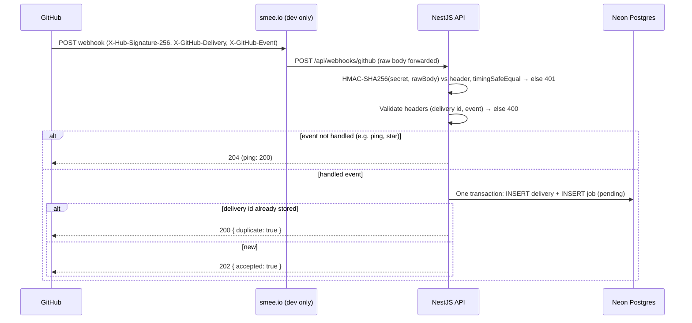
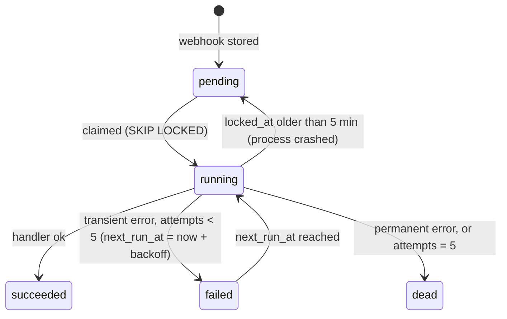

# Phase 3 — Webhook ingestion and durable queue

Receive GitHub App webhooks, reject anything not signed by GitHub, store each delivery exactly once, and process it through a durable Postgres queue that survives crashes, restarts and downstream outages. This is Session 3, the reliability core. Rules and actions (phase 4) plug into the queue built here.

Sources: [`prd.md`](../prd.md) · [`tech-stack.md`](../tech-stack.md) · [`sessions.md`](../sessions.md) (Session 3) · [phase 2](phase-2.md)

---

## 1. Scope

| In scope                                                                                  | Out of scope (later phases)                               |
| ----------------------------------------------------------------------------------------- | --------------------------------------------------------- |
| Activate the App webhook (secret, events) and a smee.io channel for local dev             | Rule matching, labels, comments, Slack (phase 4)          |
| `POST /api/webhooks/github`: raw-body HMAC check, header validation                       | Event log / failures UI, manual retry button (Session 5)  |
| Dedupe on `X-GitHub-Delivery`; delivery + job stored in one transaction; `202` fast        | Rate limiting on public endpoints (Session 6)             |
| Worker: claim with `FOR UPDATE SKIP LOCKED`, exponential backoff, dead-letter, stale-lock reclaim | Production webhook URL (Session 6)                   |
| Handlers: `issues`, `pull_request`, `push` normalised into one event shape                 | AI triage (Session 7)                                     |
| `installation` / `installation_repositories` webhooks keep repos in sync (deferred from phase 2) | Org installations                                   |
| Catch-up: find failed deliveries via the App API and request redelivery                    | Payload retention / cleanup                               |

### PRD requirements covered

| PRD item                                        | How this phase covers it                                                                                     |
| ----------------------------------------------- | ------------------------------------------------------------------------------------------------------------ |
| Core 3 — webhook, ≥ 2 event types, recorded     | `issues`, `pull_request`, `push` stored in `webhook_deliveries`                                              |
| Stretch 5 — observability                       | Job attempts, `last_error`, `dead` status; delivery id in every log line                                     |
| Quality 1 — not foolable by forged requests     | HMAC-SHA256 over the raw bytes, constant-time compare, before any parsing or DB write                        |
| Quality 1 — not foolable by replayed requests   | A replay reuses its delivery id; the primary key turns it into a no-op                                       |
| Quality 2 — no duplicate work                   | Delivery id is the PK; one job per delivery (`jobs.delivery_id UNIQUE`)                                      |
| Quality 3 — no lost events                      | Stored before `202`; retries with backoff; stale locks reclaimed after a crash; catch-up redelivers failures |
| Quality 4 — never expose secrets                | Webhook secret only in `backend/.env`; signatures and payloads never logged                                  |

---

## 2. How the flow works

### Ingestion (request path — must stay fast)



### Processing (worker loop, in-process)



**Key rules**

- The signature is checked on the **exact bytes** GitHub sent (`rawBody`), never on re-serialised JSON. Missing or wrong signature → `401` with no detail, before the payload is parsed or anything is written.
- GitHub signs no timestamp, so replay protection is the delivery id: a replayed request carries the same `X-GitHub-Delivery` and hits the primary key. GitHub's own redeliveries reuse the id too, so they are ignored the same way.
- The request path only verifies, stores and responds. No GitHub or Slack calls happen before `202` (GitHub times out at 10 s).
- If the DB write fails, respond `500`: GitHub records a failed delivery, which the catch-up job redelivers later.
- Claiming is a short transaction that marks jobs `running` and commits; the handler runs outside it. A crash leaves the job `running` with an old `locked_at`, which the next claim picks up again.
- Handlers must be safe to run twice (a crash can happen after the side effect but before `succeeded` is saved). Phase 4 guarantees this with the `actions` unique key.
- Installation ownership is never taken from the payload for writes that affect a user: `installation` events only update rows that phase 2 already linked to a user.

### Retry schedule

| Attempt that failed | Next try after       |
| ------------------- | -------------------- |
| 1                   | 30 s                 |
| 2                   | 2 min                |
| 3                   | 8 min                |
| 4                   | 32 min               |
| 5                   | → `dead` (no retry)  |

`30 s × 4^(attempt−1)` plus up to 20 % jitter. Errors marked permanent (bad payload shape) go straight to `dead`.

---

## 3. What you need to do (manual steps)

**Never paste secrets into chat or commit them.**

### Step 1 — Create a smee.io channel

Open [smee.io](https://smee.io) → **Start a new channel**. Copy the channel URL (`https://smee.io/<random>`). It is not a secret, but keep it private: anyone with it can read your webhook payloads.

### Step 2 — Generate the webhook secret

```
openssl rand -hex 32
```

Paste the output straight into `backend/.env` (step 4) and into GitHub (step 3). Don't save it anywhere else.

### Step 3 — Activate the App webhook

GitHub → **Settings → Developer settings → GitHub Apps → Edit** your App → **General**:

| Field           | Value                          |
| --------------- | ------------------------------ |
| Webhook → Active | **checked**                   |
| Webhook URL     | Your smee channel URL          |
| Webhook secret  | The value from step 2          |

Then **Permissions & events → Subscribe to events**: tick **Issues**, **Pull request**, **Push**. Save. (`installation` and `installation_repositories` events are sent to every App automatically.)

GitHub asks installed accounts to accept new events only when permissions change; event subscriptions apply straight away.

### Step 4 — Fill the env file

`backend/.env` (add)

```
GITHUB_WEBHOOK_SECRET=<value from step 2>
SMEE_URL=<smee channel URL>
```

### Step 5 — Tell Claude "phase 3 setup done"

---

## 4. What Claude builds

### Packages

| Package            | Where          | Why                                                         |
| ------------------ | -------------- | ----------------------------------------------------------- |
| `@nestjs/schedule` | backend        | Worker poll and catch-up intervals (already in tech-stack)  |
| `smee-client`      | backend (dev)  | `npm run webhooks` forwards the smee channel to localhost   |

HMAC uses Node's `crypto`. No schema migration expected: `webhook_deliveries` and `jobs` already exist from Session 1.

### Backend (`backend/src/`)

| #   | File                                            | What it does                                                                                                                                                                              |
| --- | ----------------------------------------------- | ----------------------------------------------------------------------------------------------------------------------------------------------------------------------------------------- |
| B1  | `main.ts`                                       | `NestFactory.create(..., { rawBody: true })`; JSON body limit raised (default 100 kB is too small for `push`)                                                                           |
| B2  | `config/env.ts`, `.env.example`                 | `GITHUB_WEBHOOK_SECRET` (min 32 chars), optional `SMEE_URL`; logger redaction covers the secret                                                                                          |
| B3  | `webhooks/webhook-signature.guard.ts`           | Reads `X-Hub-Signature-256`, computes `sha256=` HMAC of `req.rawBody`, length check then `timingSafeEqual`; `401` otherwise                                                              |
| B4  | `webhooks/webhook.types.ts`                     | zod schemas: required headers (delivery id is a UUID), minimal payload shapes per event (`installation.id`, `repository.id`, `action`)                                                   |
| B5  | `webhooks/webhooks.service.ts`                  | `ingest(headers, payload)`: skip unhandled events; one `$transaction` inserting delivery + job; unique violation (`P2002`) → `duplicate`. Links `repository_id` only if the repo is known |
| B6  | `webhooks/webhooks.controller.ts`               | `@Public()` `POST /api/webhooks/github` behind the guard; `202` / `200` / `204`; Swagger-documented; logs delivery id + event only                                                       |
| B7  | `queue/queue.constants.ts`                      | Poll interval (2 s), batch size (5), max attempts (5), stale lock (5 min), backoff base (30 s)                                                                                           |
| B8  | `queue/job-repository.ts`                       | `claim(n)`: one `$queryRaw` `UPDATE … WHERE id IN (SELECT … FOR UPDATE SKIP LOCKED) RETURNING`, picking due `pending`/`failed` jobs and stale `running` ones; `succeed`, `fail(err)`     |
| B9  | `queue/job-errors.ts`                           | `PermanentJobError` (→ `dead` at once); anything else is transient                                                                                                                       |
| B10 | `queue/worker.service.ts`                       | `@Interval` loop with an in-flight flag (no overlap), dispatches by `delivery.event`, stops claiming on shutdown and waits for the current batch                                        |
| B11 | `queue/job-handler.ts`, `queue/handler.registry.ts` | `JobHandler` interface keyed by event name; phase 4 registers the rule engine here                                                                                                  |
| B12 | `events/repo-event.ts`                          | Normalises `issues` / `pull_request` / `push` into one `RepoEvent` (repo, actor, title, body, labels, ref) — the matcher's input in phase 4. Handler logs it and succeeds for now       |
| B13 | `installations/installation-events.handler.ts`  | `installation.deleted` / `suspend` → remove or flag the known installation; `installation_repositories` added/removed → reuse phase 2 `sync()`. Unknown installation → succeed, no-op   |
| B14 | `webhooks/catch-up.service.ts`                  | On boot and every 15 min: `GET /app/hook/deliveries` (App JWT, cursor-paged, last 3 days), group by `guid`, for guids not in DB whose latest attempt failed → `POST …/{id}/attempts` (capped per run) |
| B15 | `webhooks/webhooks.module.ts`, `queue/queue.module.ts` | Wiring; `ScheduleModule.forRoot()` in `AppModule`                                                                                                                                   |
| B16 | `package.json`                                  | `webhooks` script: `smee --url $SMEE_URL --target http://localhost:4000/api/webhooks/github`                                                                                             |

Errors: bad signature → `401`; bad headers → `400`; DB down → `500` (GitHub retries via catch-up). Never echo the payload or the reason for a signature failure.

### Frontend

None. Deliveries and jobs are checked in Neon for now; the event log UI is Session 5.

### Order of work (one commit each)

1. B1–B3, B6 (stub) raw body + signature guard → forged request returns `401`.
2. B4–B6 persist + dedupe + enqueue → replay returns `200 duplicate`, one row.
3. B7–B11 worker: claim, backoff, dead-letter, stale reclaim, graceful stop.
4. B12–B13 event normaliser + installation handlers.
5. B14 catch-up.
6. End-to-end run, session logs, docs update.

---

## 5. Environment variables

| Variable                | Where          | Secret? | Source                                   |
| ----------------------- | -------------- | ------- | ---------------------------------------- |
| `GITHUB_WEBHOOK_SECRET` | `backend/.env` | **Yes** | `openssl rand -hex 32`, same value in the App |
| `SMEE_URL`              | `backend/.env` | No (keep private) | smee.io channel, dev only        |

---

## 6. Security checklist

- [ ] Signature verified on `rawBody` with `timingSafeEqual`, before parsing, logging or any DB write.
- [ ] Buffers compared only after a length check (`timingSafeEqual` throws on unequal lengths).
- [ ] Webhook route is the only `@Public()` POST; no auth bypass elsewhere.
- [ ] `401` / `400` responses carry no detail; the secret, signature header and payload are never logged.
- [ ] Payload data is untrusted: installation/repo ids only update rows already owned via phase 2.
- [ ] Body size limit set explicitly (not unlimited).
- [ ] `/check-secrets` clean; `SMEE_URL` and the secret only in `backend/.env`.

---

## 7. Done when (verify together)

| #   | Check                                                                                      | Expected                                                      |
| --- | ------------------------------------------------------------------------------------------ | ------------------------------------------------------------- |
| 1   | Open an issue, open a PR, push a commit on a connected repo                                | 3 rows in `webhook_deliveries`, 3 jobs `succeeded`            |
| 2   | `curl` the webhook with no / wrong signature                                               | `401`, no row written                                         |
| 3   | GitHub → App → Advanced → **Redeliver** a delivery                                         | `200 duplicate`, still one row and one job                    |
| 4   | Replay a captured signed request with `curl`                                               | `200 duplicate`                                               |
| 5   | Stop the backend, open an issue, start it again (see §8)                                 | Delivery recovered via catch-up, or noted as a local limit    |
| 6   | Kill the backend while a job is `running`, restart                                          | Job reclaimed after the stale window and `succeeded`          |
| 7   | Force a transient failure (see §8)                                                         | `attempts` rises, `next_run_at` follows the schedule, ends `dead` after 5 |
| 8   | App → Configure → remove a repo                                                            | `repositories` row gone without visiting the setup URL        |
| 9   | Backend logs during 1–8                                                                    | Delivery ids and events only; no payloads, signatures, tokens |
| 10  | `/check-secrets`                                                                           | No findings                                                   |

---

## 8. To confirm while building

| Question                                                                                   | Why it matters                                                                                  |
| ------------------------------------------------------------------------------------------ | ----------------------------------------------------------------------------------------------- |
| Does `smee-client` forward the original bytes, or re-stringify the JSON?                    | Re-stringified JSON breaks the HMAC locally (not in production)                                 |
| Catch-up can't be tested locally: smee.io answers GitHub `200` even when localhost is down | Check #5 may only pass on the deployed URL (Session 6); confirm on the delivery list in GitHub  |
| How to force a transient failure for check #7                                              | Option: dev-only `QUEUE_FAIL_EVENT=<event>` ignored in production, or a temporary code change    |
| Body limit value (1 MB vs 5 MB)                                                            | GitHub caps payloads at 25 MB; `push` is truncated to 20 commits, so a few MB is plenty        |
| Store deliveries for repos not connected (installed but setup never finished)?              | Plan: store with `repository_id = null`, job succeeds as a no-op                                |
| `installation.suspend`: delete, or keep and flag?                                          | Flag needs a column (migration); delete is simpler                                              |

---

## 9. Follow-ups in `sessions.md`

- Session 3: link this plan; add "installation webhooks keep repos in sync" and "catch-up verified on the deployed URL".
- Session 5: manual retry of `dead` jobs resets `status`, `attempts`, `next_run_at`.
- Session 6: rate limit the webhook route; re-point the App webhook URL from smee to the host; verify catch-up there.

---

## References

- [Validating webhook deliveries](https://docs.github.com/en/webhooks/using-webhooks/validating-webhook-deliveries)
- [Best practices for using webhooks](https://docs.github.com/en/webhooks/using-webhooks/best-practices-for-using-webhooks) — respond within 10 s, use the delivery id, redeliver failures
- [Handling failed webhook deliveries](https://docs.github.com/en/webhooks/using-webhooks/handling-failed-webhook-deliveries) — the catch-up script pattern
- [REST: webhook deliveries for a GitHub App](https://docs.github.com/en/rest/apps/webhooks)
- [Webhook events and payloads](https://docs.github.com/en/webhooks/webhook-events-and-payloads)
- [NestJS raw body](https://docs.nestjs.com/faq/raw-body)
- [PostgreSQL `SKIP LOCKED`](https://www.postgresql.org/docs/current/sql-select.html#SQL-FOR-UPDATE-SHARE)
