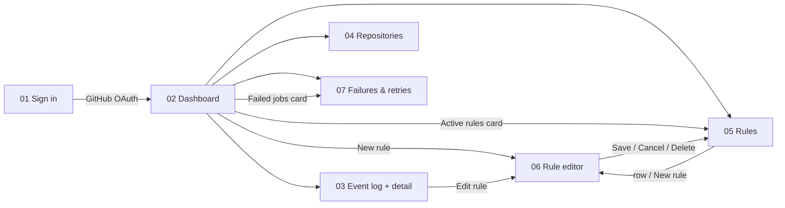

# Phase 5.5 — New UI: flow review and backend gaps

The design in [`reference/GitHub Automation Bot.html`](../reference/GitHub%20Automation%20Bot.html) replaces the phase 5 header-nav layout with a sidebar app: seven screens. This phase walks every screen, maps each piece of UI to the API that feeds it, and lists the backend changes needed **before** the frontend is rebuilt. Most of the data already exists; the gaps are counts, a few extra fields, and two condition types in rules.

**Status:** done (2026-09-26). The backend, database and frontend are built and verified end to end in Chrome against `test-bot` (see §9). Nothing is committed yet.

Sources: [phase 4](phase-4.md) (rules, actions) · [phase 5](phase-5.md) (read APIs, retry) · [`prd.md`](../prd.md) · [`sessions.md`](../sessions.md)

> The reference file is a bundled export. Each screen is a nested bundle; to read the markup, unpack `__bundler/manifest` (base64 + gzip) twice. Screen size is 1440 × 960, light and dark.

---

## 1. Scope

| In scope                                                                   | Out of scope                                             |
| -------------------------------------------------------------------------- | -------------------------------------------------------- |
| Backend changes the seven screens need (fields, counts, 2 new endpoints)   | Building the new frontend (next step, after this phase)  |
| One migration: new columns and one index                                   | Websockets / SSE (still short polling)                   |
| Rule conditions: `excludeAuthors` ("author is not") and `match: all / any` | AI triage (Session 7)                                    |
| Swagger + unit tests for every change                                      | Raw payload in the API (still never returned)            |

**Legend used below:** **Exists** = current API already returns it · **Client** = derive in the frontend, no API change · **Change** = extend an existing endpoint · **New** = new endpoint or column.

---

## 2. Screen flow



**App shell (every screen but sign-in):** left sidebar with brand, nav (Dashboard · Event log · Repositories *(count)* · Rules · Failures *(count)*), a webhook health box ("Webhook healthy · Last delivery 12s ago · queue 0") and the user (initials, name, `@login`, sign out). Top bar: breadcrumb, "Live · refreshes every 5s", repo filter ("All repositories"), dark mode toggle.

Proposed routes: `/` dashboard · `/events` (detail via `?delivery=<id>`) · `/repositories` · `/rules` · `/rules/new` · `/rules/:id` · `/failures`. The repo filter stays in `?repo=` as in phase 5.

---

## 3. Screen by screen

### 01 Sign in

| UI                                                    | Source                         | Status |
| ----------------------------------------------------- | ------------------------------ | ------ |
| Hero, 3-step list, "what we access" notes             | Static copy                    | Client |
| "Continue with GitHub"                                | Neon Auth social sign-in       | Exists |

### App shell (sidebar + top bar)

| UI                                               | Source                                                     | Status     |
| ------------------------------------------------ | ---------------------------------------------------------- | ---------- |
| Repositories count                               | `GET /repositories` → `repositories.length`                | Exists     |
| Failures count                                   | `GET /stats` → `jobs.retrying + jobs.dead`                 | **Change** (S1) |
| "Webhook healthy" / "Last delivery 12s ago"      | `GET /stats` → `webhook.configured`, `webhook.lastDeliveryAt` | Exists  |
| "queue 0"                                        | `GET /stats` → `jobs.pending`                              | **Change** (S1) |
| User name, initials                              | `GET /me` → `name`                                         | Exists     |
| `@login` (GitHub handle), avatar                 | `GET /me` → `githubLogin`, `image`                         | **Change** (M1) |
| Repo filter, dark mode, "Live" pill              | `GET /repositories`; local state                           | Exists / Client |

### 02 Dashboard

| UI                                                        | Source                                                                  | Status          |
| --------------------------------------------------------- | ----------------------------------------------------------------------- | --------------- |
| Events received **128**                                   | `stats.events`                                                          | Exists          |
| "**+18** vs yesterday"                                    | `stats.eventsPrevious` (24–48 h ago)                                    | **Change** (S1) |
| Actions taken **96** · "41 labels · 22 comments · 33 Slack" | `stats.actionsByType` (succeeded, 24 h)                               | **Change** (S1) |
| Failed jobs **3** · "2 retrying · 1 dead-lettered"        | `stats.jobs.retrying`, `stats.jobs.dead`                                | **Change** (S1) |
| Active rules **5 / 6** · "Across 3 repositories"          | `GET /rules` → count `enabled`, distinct `repositoryId`                 | Client          |
| Live activity table: event, subject, repo, status, when   | `GET /events?limit=6`                                                   | Exists          |
| Action chips "label: bug", "comment", "Slack"             | `events.items[].actions[]` + label names                                | **Change** (E1) |
| Status "Done" / "Retrying 2/5" / "Recorded" (no rule)     | `job.status`, `job.attempts`, `maxAttempts`; no actions → "No rule matched" | **Change** (E2) |
| Job queue: Pending · Done · Retrying · Dead               | `stats.jobs.*`                                                          | **Change** (S1) |
| Actions by type (bars)                                    | `stats.actionsByType`                                                   | **Change** (S1) |

### 03 Event log + detail drawer

| UI                                                           | Source                                                                       | Status          |
| ------------------------------------------------------------ | ---------------------------------------------------------------------------- | --------------- |
| Search "title, author, delivery ID"                          | `GET /events?q=`                                                             | **Change** (E3) |
| Tabs All / Issues / Pull requests / Push                     | `GET /events?event=`                                                         | Exists          |
| "Status: any" filter                                         | `GET /events?status=`                                                        | Exists          |
| Row status "Done · 2 actions", "Retrying 2/5", "No rule matched" | job status + action count + `maxAttempts`                                | **Change** (E2) |
| Row time `10:42:08`                                          | `receivedAt`                                                                 | Exists          |
| "Showing 7 of **128** events"                                | `total` for the current filters                                              | **Change** (E4) |
| Previous / Next                                              | Next = `before=nextCursor`; Previous = pop a client-side cursor stack        | Client          |
| Drawer header: event, status, title, repo, "opened by @x", time | `GET /events/:deliveryId`                                                 | Exists          |
| Delivery ID, Received, Job "Done · 1 attempt"                | `detail.id`, `receivedAt`, `job`                                             | Exists          |
| Signature "Verified HMAC-SHA256"                             | Constant: every stored delivery passed the signature guard                   | Client          |
| **Rule matched** name + condition sentence + "Edit rule"     | `detail.rules[]` (id, name, event, conditions)                               | **Change** (E5) |
| Actions taken: "Added label **bug**", "212 ms", "attempt 1"  | `actions[].result.labels`, `attempts`; duration → `actions[].durationMs`    | Exists / **New** (A1, optional) |
| "GitHub API 200" / "Slack 200 ok"                            | Not stored. Show "Succeeded" / error text instead                            | Client (drop)   |
| Payload excerpt                                              | Rebuild a small JSON from `summary` (action, number, title, author, repo). Raw payload stays private | Client |
| View on GitHub / Copy delivery ID                            | `summary.url`, `id`                                                          | Exists          |

### 04 Repositories

| UI                                                                   | Source                                                              | Status          |
| -------------------------------------------------------------------- | ------------------------------------------------------------------- | --------------- |
| Installation header: account login, installation id                 | `installations[]`                                                   | Exists          |
| "Personal account" / "Organization"                                  | `installations[].accountType`                                       | **Change** (R1) |
| "selected repos" / "all repos"                                       | `installations[].repositorySelection`                               | **Change** (R1) |
| "Configure on GitHub" link                                           | `accountType` decides `/settings/installations/:id` vs `/organizations/:org/settings/installations/:id` | Client (needs R1) |
| Repo: full name, Public/Private                                      | `repositories[]`                                                    | Exists          |
| Default branch "main"                                                | `repositories[].defaultBranch`                                      | **Change** (R1) |
| Rules count                                                          | `repositories[].ruleCount`                                          | **Change** (R2) |
| Last event "8m ago" / "No events yet"; status Receiving / Waiting    | `repositories[].lastEventAt` (status derived)                       | **Change** (R2) |
| Event chips issues · pull_request · push                             | App-wide, from `GET /app`                                           | **New** (R3)    |
| "Sync from GitHub"                                                   | `POST /installations/:id/sync` for each installation                | Exists          |
| "Connect repository" / "Install GitHub App"                          | `github-urls.ts` install URL                                        | Exists          |
| App permissions panel (Issues R/W, PRs R/W, Metadata R, Contents none) | `GET /app` → `permissions`                                        | **New** (R3)    |
| Subscribed events panel                                              | `GET /app` → `events`; sub-labels ("opened, closed") are static copy of what the bot handles | **New** (R3) |

### 05 Rules

| UI                                                           | Source                                                    | Status          |
| ------------------------------------------------------------ | --------------------------------------------------------- | --------------- |
| Enable switch                                                | `PATCH /rules/:id { enabled }`                            | Exists          |
| Name, repo short name                                        | `GET /rules` + repo map from `/repositories`              | Exists          |
| When `issues.opened`                                         | `event` + `conditions.actions` (default `opened`)         | Exists          |
| If: "title contains bug", "labels include docs"              | `conditions`                                              | Exists          |
| If: "author is not dependabot[bot]"                          | `conditions.excludeAuthors`                               | **Change** (U1) |
| If: "title **or** body contains security, leak"              | `conditions.match = 'any'`                                | **Change** (U2) |
| Then chips                                                   | `actions[]`                                               | Exists          |
| Fired **41** · "12s ago"                                     | `firedCount`, `lastFiredAt` per rule                      | **Change** (U3) |
| All / Enabled / Disabled tabs, count, search                 | Filter the list                                           | Client          |
| Row menu (Edit, Delete)                                      | `PATCH` / `DELETE /rules/:id`                             | Exists          |

### 06 Rule editor

| UI                                                        | Source                                                         | Status          |
| --------------------------------------------------------- | -------------------------------------------------------------- | --------------- |
| Load a rule by URL (`/rules/:id`, reload-safe)            | `GET /rules/:id`                                               | **New** (U4)    |
| Name, Repository picker                                   | Rule fields; `/repositories`                                   | Exists          |
| WHEN: Issue opened / PR opened / Code pushed              | `event` (+ `conditions.actions: ['opened']`)                   | Exists          |
| IF: Match **all / any**                                   | `conditions.match`                                             | **Change** (U2) |
| Title / Body contains (keyword chips)                     | `titleContains`, `bodyContains`                                | Exists          |
| Author is / **is not**                                    | `authors` / `excludeAuthors`                                   | Exists / **Change** (U1) |
| Labels include                                            | `labels`                                                       | Exists          |
| THEN: Add label (chips), Post comment (body), Slack       | `actions[]`; push allows Slack only (schema already enforces)  | Exists          |
| Summary sentence, "Unsaved changes"                       | Built from form state                                          | Client          |
| Save / Delete / Enabled                                   | `POST` / `PATCH` / `DELETE /rules`                             | Exists          |

### 07 Failures & retries

| UI                                                               | Source                                                                  | Status          |
| ---------------------------------------------------------------- | ----------------------------------------------------------------------- | --------------- |
| Retrying **2** · Dead **1**                                      | `stats.jobs.retrying`, `stats.jobs.dead` (or count the list)            | **Change** (S1) |
| "Missed deliveries caught up on boot **4**"                      | `stats.recoveredDeliveries` (last 24 h)                                 | **New** (C1)    |
| Tabs Retrying / Dead                                             | `status` = `failed` (retrying) / `dead`                                 | Client          |
| Row per failing **action**: "Slack notification", "503", "2 / 5" | `failures.items[].actions[]` incl. transient errors (status `pending` + `error`) | **Change** (F1) |
| "in 38s" next try                                                | `nextRunAt`                                                             | Exists          |
| Short delivery id `7c1e9a42`                                     | `deliveryId.slice(0, 8)`                                                | Client          |
| Retry now                                                        | `POST /jobs/:id/retry`                                                  | Exists          |
| Job details: status, "2 of 5", last error, next run              | failure item + `maxAttempts`                                            | **Change** (E2) |
| "Actions for this delivery": "Done · skipped on retry", "Pending retry" | all actions of the delivery (F1)                                 | **Change** (F1) |
| "Backoff doubles each attempt"                                   | **Copy is wrong**: backoff is ×4 (30 s, 2 m, 8 m, 32 m). Fix the text   | Client          |

---

## 4. Backend changes

Grouped by module. P1 = the screens can't be built faithfully without it; P2 = can ship with a fallback.

### Stats — `GET /stats` (events module)

**S1 · P1.** Extend the response. Counts stay user-scoped via repo → installation → user, and follow `?repositoryId=`.

```ts
{
  events: number,                // exists, last 24 h
  eventsPrevious: number,        // new: 24–48 h ago, for "+18 vs yesterday"
  actionsSucceeded: number,      // exists
  actionsFailed: number,         // exists
  actionsByType: { add_label: number, add_comment: number, slack_notify: number }, // new: succeeded, 24 h
  jobs: {                        // new: current state, not windowed — except succeeded
    pending: number,             // pending + running
    retrying: number,            // status = failed (waiting for next_run_at)
    dead: number,
    succeeded: number,           // last 24 h
  },
  jobsDead: number,              // keep for now; same as jobs.dead windowed — drop once the frontend moves
  webhook: { configured, lastDeliveryAt }, // exists
}
```

One extra `GROUP BY a.type` and one `GROUP BY j.status` in the existing CTE. The sidebar polls this too, so keep it a single round trip.

### Events — `GET /events`, `GET /events/:deliveryId`

**E1 · P1.** Action chips need the label names ("label: bug"). Add `labels: string[] | null` to each chip, read from the rule's action definition (not the result, so it shows before the action runs). Alternative: expose the rule's `actions[]` config per chip. Keep it to labels.

**E2 · P1.** Add `maxAttempts: 5` (from `queue.constants.ts`) to every `job` object (list, detail, failures) so the UI never hard-codes it.

**E3 · P1.** `q` query param (trimmed, max 100 chars). Matches, case-insensitive: summary title, sender login, or delivery id prefix. Use `ILIKE` with `%` / `_` escaped. Fine at this scale (user-scoped rows); note a trigram index as a later option.

**E4 · P1.** Add `total: number` to the page: `count(*)` with the same filters, no cursor. Only computed when `before` is absent (first page), `null` otherwise; the client keeps the first value.

**E5 · P1.** Event detail gets `rules: { id, name, event, conditions }[]` — the distinct rules that produced actions for this delivery, with their **current** definition. Rules are deleted with their actions (cascade), so every listed rule exists.

### Actions

**A1 · P2.** New nullable `actions.duration_ms int`, set in `succeed` / `fail` from a timer around `execute`. Returned as `durationMs` in event detail. Fallback: hide the timing.

### Failures — `GET /failures`

**F1 · P1.** Replace `failedActions` with `actions`: **every** action of the delivery with `{ id, type, ruleName, status, attempts, error }`. A transient failure leaves the action `pending` with `error` set — today those are invisible, so a retrying Slack call can't be shown. The UI shows rows for actions with `error`, and the side panel lists all of them ("Done · skipped on retry").

### Catch-up

**C1 · P2.** "Missed deliveries caught up". New table `redelivery_requests (delivery_id text PK, requested_at)`: `CatchUpService` records each guid it asks GitHub to redeliver and prunes rows older than 7 days on every run. `stats.recoveredDeliveries` counts the caller's deliveries from the last 24 h whose id is in that table → user-scoped, restart-safe. No FK, since the redelivery may not have arrived yet.

### Rules — `/rules`

**U1 · P1.** `conditions.excludeAuthors: string[]` (same login regex as `authors`, default `[]`). Matcher: if the actor is in the list, no match. Always a hard filter, independent of `match`.

**U2 · P1.** `conditions.match: 'all' | 'any'` (default `'all'`, so stored rules keep their meaning). `all` = every non-empty positive list must hold (today's behaviour). `any` = at least one non-empty positive list holds. Positive lists: `titleContains`, `bodyContains`, `authors`, `labels`. Event, webhook action, branches and `excludeAuthors` always apply. Both are JSON fields → no migration; the zod default fills old rows on read.

**U3 · P1.** `GET /rules` items get `firedCount` (distinct deliveries with an action row for the rule, all time) and `lastFiredAt` (latest action `created_at`, nullable). One grouped query over `actions` for the listed rule ids. Needs index `actions(rule_id, created_at)` — the unique key leads with `delivery_id`.

**U4 · P1.** `GET /rules/:id` → `ruleSchema` (+ U3 fields). 404 for unknown or another user's rule, like `PATCH`.

### Repositories / installations

**R1 · P1.** New columns, filled on connect, sync and installation webhooks (all already call GitHub):

| Table           | Column                               | From GitHub                                  |
| --------------- | ------------------------------------ | -------------------------------------------- |
| `installations` | `account_type text` (`User` / `Organization`) | `installation.account.type` (already parsed, not stored) |
| `installations` | `repository_selection text` (`all` / `selected`) | `installation.repository_selection`   |
| `repositories`  | `default_branch text null`           | `repository.default_branch` (installation repos list) |

Returned as `accountType`, `repositorySelection`, `defaultBranch`. Existing rows backfill on the next sync (the "Sync from GitHub" button).

**R2 · P1.** `GET /repositories` items get `ruleCount` (enabled + disabled) and `lastEventAt` (max `received_at`, nullable). Two grouped subqueries; `webhook_deliveries(repository_id, received_at)` is already indexed.

**R3 · P2.** `GET /app` (authenticated) → `{ events: string[], permissions: Record<string, 'read' | 'write'> }` from GitHub `GET /app` with the App JWT (`GithubAppService.appJwt`). Cache 10 min, like the hook config check. Fallback: static copy in the frontend (drifts if the App settings change).

### Me — `GET /me`

**M1 · P1.** Add `githubLogin: string | null` and `image: string | null`. `image` from the JWT `image` claim (https URLs only). `githubLogin`: one SQL join from `neon_auth.account` to the caller's installation (`connect` only accepts the caller's own personal account, so the login is theirs). No GitHub call; null until the App is installed — the UI falls back to the name.

### Migration (one)

Two migrations, both applied:

- `20260926120000_new_ui_fields`: `actions.duration_ms`, `installations.account_type`, `installations.repository_selection`, `repositories.default_branch`, index `actions(rule_id, created_at)`. All nullable → no downtime, no data rewrite. Existing rows were backfilled by one Sync.
- `20260926140000_redelivery_requests`: the C1 table plus an index on `requested_at`.

### API summary

| Endpoint                         | Change                                                                 | ID            |
| -------------------------------- | ---------------------------------------------------------------------- | ------------- |
| `GET /me`                        | + `githubLogin`, `image`                                               | M1            |
| `GET /stats`                     | + `eventsPrevious`, `actionsByType`, `jobs{…}`, `recoveredDeliveries`  | S1, C1        |
| `GET /events`                    | + `q`, `total`, chip `labels`, `job.maxAttempts`                       | E1–E4         |
| `GET /events/:deliveryId`        | + `rules[]`, `job.maxAttempts`, (`actions[].durationMs`)               | E2, E5, A1    |
| `GET /failures`                  | `failedActions` → `actions` (all, incl. transient errors), `maxAttempts` | F1, E2      |
| `GET /rules`                     | + `firedCount`, `lastFiredAt`; conditions + `excludeAuthors`, `match`  | U1–U3         |
| `GET /rules/:id`                 | **new**                                                                | U4            |
| `POST` / `PATCH /rules`          | accept `excludeAuthors`, `match`                                       | U1, U2        |
| `GET /repositories`              | + `accountType`, `repositorySelection`, `defaultBranch`, `ruleCount`, `lastEventAt` | R1, R2 |
| `GET /app`                       | **new**: App permissions + subscribed events                           | R3            |
| `POST /installations/:id/sync`, `POST /jobs/:id/retry`, `DELETE /rules/:id` | unchanged                                   | —             |

---

## 5. Order of work (one commit each)

1. Migration + Prisma client (R1 columns, A1, U3 index).
2. Rules: U1, U2 (schema + pure matcher + tests), U3, U4.
3. Stats S1 + events E1–E5.
4. Failures F1.
5. Repositories R1, R2; `GET /app` R3; `GET /me` M1.
6. A1 timing, C1 catch-up count.
7. Swagger check, unit tests green, update [`sessions.md`](../sessions.md) and this file's checklist.

Then the frontend rebuild (shell, dashboard, event log, repositories, rules, rule editor, failures) against these APIs.

---

## 6. Security checklist

- [x] Every new count and field goes through repo → installation → `user_id = caller`.
- [x] `q` is parameterised and `%` / `_` escaped; length-capped.
- [x] Still no raw payload in any response; the drawer's "payload excerpt" is rebuilt from the summary.
- [x] `GET /rules/:id` returns 404 (not 403) for another user's rule.
- [x] `GET /app` exposes permissions and events only — never the webhook URL or secret.
- [x] `githubLogin` / `image` are the caller's own; `image` accepts https URLs only.

---

## 7. Done when — verified 2026-09-26

320 backend unit tests pass. Live checks ran against Neon and [`test-bot`](https://github.com/jayshreee10/test-bot) with a local backend + smee. Services were called directly as the repo owner where a browser JWT was needed. Test issues #21 and #22, the three temporary rules and the `security` label were removed afterwards.

| #   | Check                                                                                  | Result                                                                                           |
| --- | -------------------------------------------------------------------------------------- | ------------------------------------------------------------------------------------------------ |
| 1   | `GET /stats` on live data                                                              | ✅ `actionsByType`, `jobs`, `eventsPrevious`, `recoveredDeliveries` returned; moved after each test issue |
| 2   | Rule with `excludeAuthors: ["jayshreee10"]`; issue opened by jayshreee10               | ✅ Not matched ("1/4 rules matched"); no `excluded-check` label                                    |
| 3   | Rule with `match: "any"`, title + body "security"; issue with it only in the body      | ✅ Matched; `security` label added; detail shows the rule, `durationMs` 1587                      |
| 4   | Existing rules stored without `match` / `excludeAuthors`                               | ✅ Parse with defaults; did not fire on the test issues                                            |
| 5   | Slack rejects the webhook (placeholder URL → 404), open a matching issue               | ✅ `/failures` lists the Slack action with `Slack webhook 404`; retry reran only it (attempts 1 → 2); second retry → 409 |
| 6   | Search by title, author, delivery id prefix, `%`/`_` literals                          | ✅ Correct hits; `total` matches; `null` on cursor pages                                           |
| 7   | `GET /rules` fired stats                                                               | ✅ Matched rule `firedCount` 1 with `lastFiredAt`; excluded rule 0 / null                          |
| 8   | Sync once                                                                              | ✅ 55/55 repos got `defaultBranch`; installation `accountType: User`, `repositorySelection: all`   |
| 9   | Another user's rule id; every API route without a JWT                                  | ✅ `NotFoundError` (404); `401` on `/me`, `/stats`, `/app`, `/rules/:id`, `/events`                |
| 10  | Swagger (`/api/docs-json`)                                                             | ✅ `GET /app`, `GET /rules/{id}`, `q` param and every new field listed                             |

Not covered live: a *transient* (5xx) Slack failure. Config only accepts `hooks.slack.com` URLs, so no stub is possible. The unit tests cover it (pending action with `error` listed in `/failures`).

**Note:** `GET /app` shows the App has `contents: write`. The design says "Contents: No access", and the bot never reads code. Consider dropping that permission in the GitHub App settings (least privilege).

---

## 8. To confirm before building

| Question                                                                          | Recommendation                                                                 |
| --------------------------------------------------------------------------------- | ------------------------------------------------------------------------------ |
| Support `match: any`, or show "all" as fixed text?                                | **Decided:** supported                                                         |
| "Fired" = matched deliveries or succeeded actions?                                | **Decided:** matched deliveries (any action row)                               |
| Keep the "Missed deliveries caught up" tile?                                      | **Decided:** built (C1), counts the last 24 h                                   |
| Show HTTP status per action ("GitHub API 200")?                                   | No: not stored and adds little; show outcome + attempt (+ duration if A1)      |
| Previous/Next paging vs "Load more"                                               | Previous/Next with a client cursor stack; no backward cursor in the API        |
| Push rules: expose `branches` in the editor? The design doesn't show it           | Keep in API; add a "Branch is" condition in the editor only for push           |
| Separate Dashboard (`/`) and Event log (`/events`) pages                          | Yes, as designed; both reuse `GET /events`                                      |

---

## 9. Frontend — built and verified 2026-09-26

The seven screens now follow the reference design: tokens, Inter + JetBrains Mono, light and dark themes, a 256px sidebar and a 64px top bar.

| Area | Files |
| --- | --- |
| Theme and shell | `styles/globals.css` (design tokens), `lib/theme.ts`, `lib/status.ts`, `lib/time.ts` (`shortAge`, `shortUntil`, `clockTime`), `lib/initials.ts`, `components/{status-badge,chip,segmented}.tsx`, `features/shell/{app-shell,sidebar,top-bar,repo-filter,webhook-health}` |
| Dashboard `/` | `features/dashboard/*`: stat cards, live activity (5 s), job queue, actions by type |
| Event log `/events` | `features/events/*`: search (`q`), type tabs, status filter, Previous/Next cursor stack, side detail panel kept in `?delivery=` |
| Repositories | `features/repositories/*`: installation cards, sync all, Configure link (user or org), App permissions and events |
| Rules and editor | `features/rules/*`: list with fired stats, WHEN/IF/THEN editor with match all/any, "is not" author, chip inputs, live summary |
| Failures | `features/failures/*`: tiles (incl. recovered deliveries), tabs, retry, job details; backoff copy corrected to ×4 |
| Sign in | `features/auth/login-page.tsx`: two-column design, same auth flow |

Checks: 173 frontend tests, typecheck, oxlint and `vite build` are clean. Styles use semantic `@apply` classes only.

**Verified in Chrome** with the local backend, smee and real GitHub webhooks:

- Dashboard stats, queue, actions by type, live activity and sidebar webhook health all showed live data.
- Event log search ("slack is broken" → 3 of 3). The detail panel showed the matched rule sentence, actions with durations and attempts, and the payload excerpt.
- Repositories: real account type and selection, default branches, App permissions. "Sync from GitHub" synced 55 repos, with a toast.
- Rule created in the editor (match **any**, title/body, author **is not**, label). Issue #23, with the keyword only in its body, got `ui-check` within seconds, and the dashboard updated live.
- Rule edited (Slack on), with Slack pointed at a rejected placeholder URL. The Failures page showed "Slack webhook 404"; **Retry now** re-ran only the Slack action.
- Light/dark toggle, and rule delete through the confirmation dialog.

Cleanup: issues #23 and #24 closed, the test rule and `ui-check` label deleted, the browser theme preference cleared.

Not seen live: the sign-in page (it needs a signed-out session; unit tests cover it), and a transient (5xx) Slack retry.

---

## 10. Second end-to-end run — Aster and test-bot, 2026-09-26

The whole flow ran on a second repository, [`jayshreee10/Aster`](https://github.com/jayshreee10/Aster), using the UI and real GitHub events:

| Step | Result |
| --- | --- |
| Rules created in the editor with the filter on Aster (repo preselected) | "Aster bug triage" (match any: title bug/crash or body crash, author is not dependabot[bot] → label + comment + Slack), "Aster PR review" (any PR → label + comment + Slack), "Aster push alerts" (branch is `e2e-phase-5-5` → Slack) |
| Issue #1, "bug: …" in the title | `bug` label, comment and Slack |
| Issue #2, "crash" only in the body | Same actions, through match **any** |
| Branch `e2e-phase-5-5` with one commit (2 push events) | Push rule sent Slack for both |
| PR #3 | `needs-review` label, comment and Slack; detail panel shows timings |
| Rule disabled in the UI, then issue #4 | No actions ("0/0 rules matched"); rule re-enabled |
| Aster dashboard, event log, Repositories row | 9 events and 11 actions (3 labels, 3 comments, 5 Slack); Aster shows 3 rules and "Receiving" |
| Filter behaviour | Aster and test-bot views are separate; `?repo=` persists; the sidebar stays workspace-wide |

Fixed during this run:

- **`/repositories` was slow (5–8 s, fetched 4× per page).** The list is now one SQL query (1 round trip instead of 3), and the frontend shares one request across components (`use-repositories.ts` store).
- **The first burst of API calls took 3.5 s.** `pg` closed idle connections after 10 s, and reopening one to Neon costs several round trips. Pool idle timeout is now 5 min (`prisma.service.ts`). Pages now load with each call around 300 ms.
- **The rule editor dropped a Branch condition.** Radix Select sent `''` when the operator list changed, so the operator went blank. Empty values are now ignored and the select is keyed by field.
- **The rules "If" column overflowed** into "Then". It now wraps.

Left on GitHub for review: Aster issues #1, #2 and #4, PR #3 with branch `e2e-phase-5-5`, and the three Aster rules.

---

## References

- [GitHub REST: get the authenticated app](https://docs.github.com/en/rest/apps/apps#get-the-authenticated-app)
- [GitHub REST: installation object (`repository_selection`, `account.type`)](https://docs.github.com/en/rest/apps/apps#get-an-installation-for-the-authenticated-app)
- [GitHub REST: list repositories accessible to the installation](https://docs.github.com/en/rest/apps/installations#list-repositories-accessible-to-the-app-installation)
